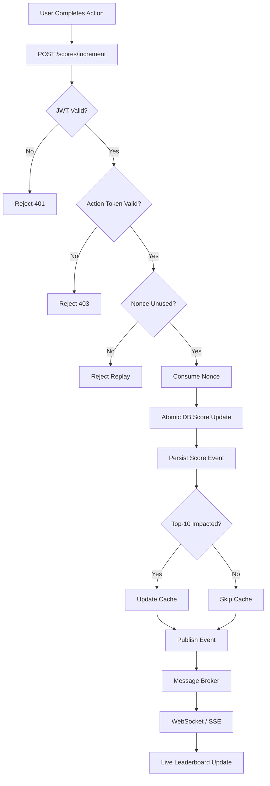
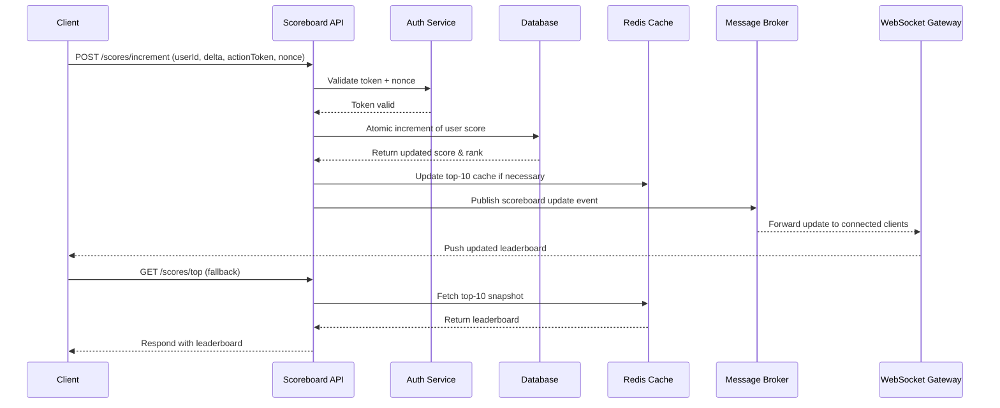

# Live Scoreboard Backend Module Specification

## Overview

This module manages user scores, ensures data integrity, and distributes real-time updates to connected clients. It is designed to prevent unauthorized score manipulation while keeping the top-10 leaderboard accurate and up-to-date.

---

## Objectives

- Accept and validate score updates triggered by user actions.
- Persist scores securely in a database.
- Provide real-time leaderboard updates to clients via WebSockets or SSE.
- Protect against replay attacks and unauthorized score changes.
- Support queries for the top-10 leaderboard or individual user scores.

---

## Module Responsibilities

### 1. API Endpoints

| Endpoint             | Method | Purpose                                           |
|---------------------|--------|-------------------------------------------------|
| `/scores/increment` | POST   | Increment a user's score after validating action authenticity. |
| `/scores/top`       | GET    | Return cached top-10 leaderboard entries.       |
| `/scores/:userId`   | GET    | Retrieve an individual user's score and rank.  |

### 2. Authentication & Authorization

- Validate short-lived signed tokens or JWTs issued alongside user actions.
- Prevent replay attacks using unique nonces per action.
- Enforce user-level permissions (e.g., only authorized users can apply bonus points).

### 3. Data Management

- Store scores in a `user_scores` table.
- Use atomic operations to prevent race conditions.
- Cache top-10 results for fast read performance (Redis or similar).

### 4. Real-Time Distribution

- Publish score changes to a message bus (`scoreboard.updates`).
- Push updates to WebSocket or SSE clients subscribed to leaderboard changes.

### 5. Observability

- Log update attempts, including success/failure and request IDs.
- Emit metrics: update rate, cache hits/misses, authorization failures.

---

### 6. Live Scoreboard Backend – Flowchart

---

## Execution Flow


## Data Model
`user_scores`
```
| Column     | Type      | Notes              |
| ---------- | --------- | ------------------ |
| user_id    | UUID (PK) | One row per user   |
| score      | INT       | Total score        |
| updated_at | TIMESTAMP | Last update        |
| version    | INT       | Optimistic locking |
```
---
`score_events`
```
| Column     | Type      | Notes        |
| ---------- | --------- | ------------ |
| id         | UUID      | Event ID     |
| user_id    | UUID      | User         |
| delta      | INT       | Score change |
| nonce      | STRING    | Anti-replay  |
| source     | STRING    | Action type  |
| created_at | TIMESTAMP | Audit trail  |
```
---
`action_nonces (Redis)`
```
| Field      | Purpose         |
| ---------- | --------------- |
| nonce      | Prevent replay  |
| user_id    | Ownership       |
| expires_at | TTL enforcement |
| consumed   | Single-use      |

```

---
## Real-Time Update Strategy
- Score changes are published to a message broker
- WebSocket / SSE gateways subscribe to updates
- Clients receive immediate leaderboard refreshes
- Polling is only a fallback
---

## Observability & Monitoring
### Logging
- Score update attempts
- Authorization failures
- Replay detection events
### Metrics
- Score update rate
- Cache hit/miss ratio
- WebSocket connected clients
- Authorization failure count

---

## API Contracts

### `POST /scores/increment`

- **Headers:** `Authorization: Bearer <JWT>`, `X-Action-Nonce`
- **Body:**
```json
{
  "userId": "uuid",
  "delta": 10,
  "actionToken": "string"
}
```
--- 

## Error Handling
```
| Scenario            | Response |
| ------------------- | -------- |
| Invalid token       | 401      |
| Invalid permissions | 403      |
| Replay detected     | 409      |
| DB failure          | 500      |
```
--- 
### Suggested Improvements (Future Work)
`These are not required for initial implementation.`
1. Rate limiting per user
2. Anti-bot heuristics
3. Shard leaderboard by region
4. Async batch leaderboard rebuilds
5. GraphQL subscription support
6. Admin audit dashboard
7. Cheat-detection ML models
---